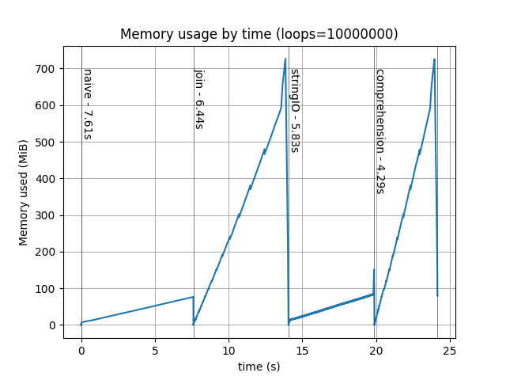
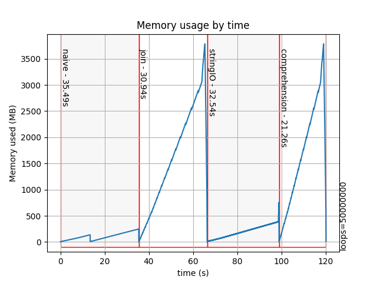

Overview
========

*memprof* is a python program used to get a memory usage profile from
the execution of another executable program.  *memprof* takes one or more
names+filenames and executes each file in another process, keeping track of
the memory used by the process.  Profile data is written to an output
file.  This profile data can be plotted.

See the *__doc__* string in memprof.py for usage.

This program was written to help determine memory usage in various of the
performance tests elsewhere in this GitHub repository.  It does this by saving
all memory measurement values in a single file, as well as the "stdout" of each
in a save directory.  The aim is to generate enough data such that suite of speed
test programs can be used with memprof to automatically create a result PDF file.

Plotting
--------

After running the *memprof.py* program, the data stored in the output file
may be plotted with *plot.py*.

Doing::

    make test

will run the profile code (takes about a minute) and then produces the final
plot image.

Requirements
------------

Uses the *psutil* module, which you can get from: https://pypi.org/project/psutil/ .

Also uses *matplotlib* to plot the graph, get from: https://matplotlib.org/faq/installing_faq.html .

Alternatively, do::

    pip3 install -r requirements.txt

Status
------

The system is running with four test executables measuring string concatenation
time and memory usage.  The output image is:

There is one *funny* noted.  If the number of test loops (defined in **common.py**)
is set to 50 million, we see glitches in the graph:

