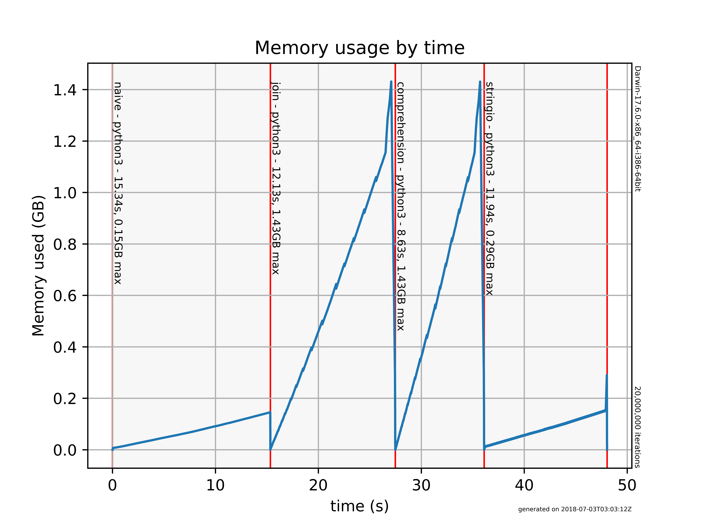

Overview
========

*memprof* is a program used to get a memory usage profile from the execution of
one or more external programs.  A plot file is produced showing memory usage of
each program with time.  The raw plot data may optionally be saved to a file.

Usage
-----

Usage: memprof [-h] [-i <file_list>] [-f <filename>] [-o <profile_file>]  \
                   [-p <plotimage>] [-q] [-s <stdout_save_dir>]

where -h                    prints help messages and quits,
      -i <name_file>        profiles name+filename (cumulative),
      -f <filename>         get list of name+filename from file (cumulative),
      -o <profile_file>     optionally write raw profile data to <profile_file>
      -p <plotimage>        if specified, the path to the plot file to produce
                            (default "memprof.png")
      -q                    don't show the plot file, just save it
      -s <stdout_save_dir>  path to the directory to save "stdout" files
                            (default "__stdout__")

Examples
--------

Doing this at the command line:

    ./memprof.py -i test,"ls -lR" -i test2,"ls -lR" -a "test annotation"

results in this plot file:

Requirements
------------

Uses the *psutil* module, which you can get from: https://pypi.org/project/psutil/ .

Also uses *matplotlib* to plot the graph, get from: https://matplotlib.org/faq/installing_faq.html .

Alternatively, do::

    pip3 install -r requirements.txt
