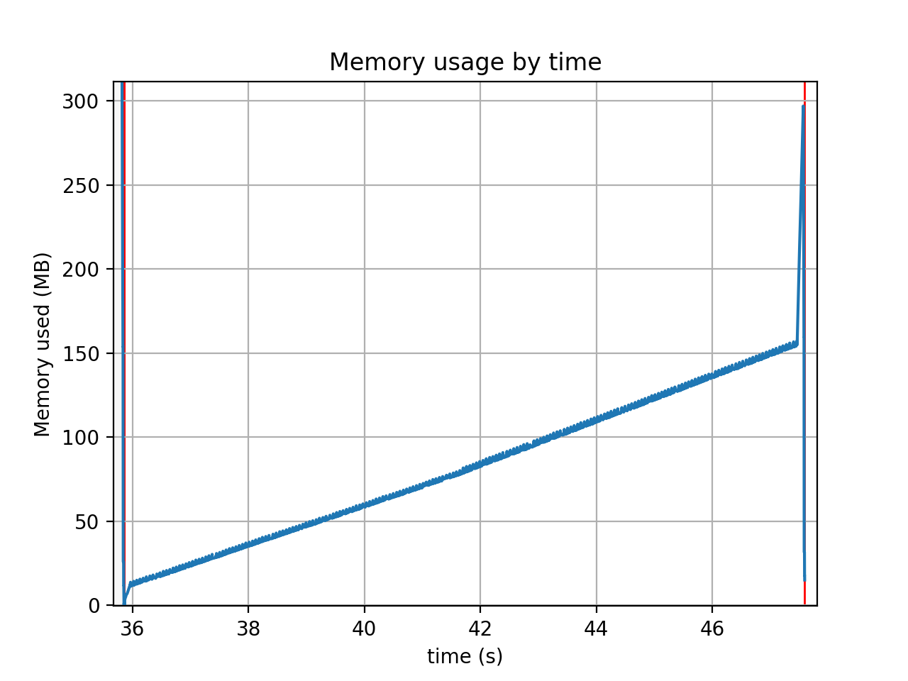

Observations on "memprof" performance
-------------------------------------

Comparing the plotted data for the "stringio" test cases, I noticed that the
line drawn for the python3 dataset was slightly thicker than the python2 data.
Zooming in a little in the matplotlib viewer showed this:

