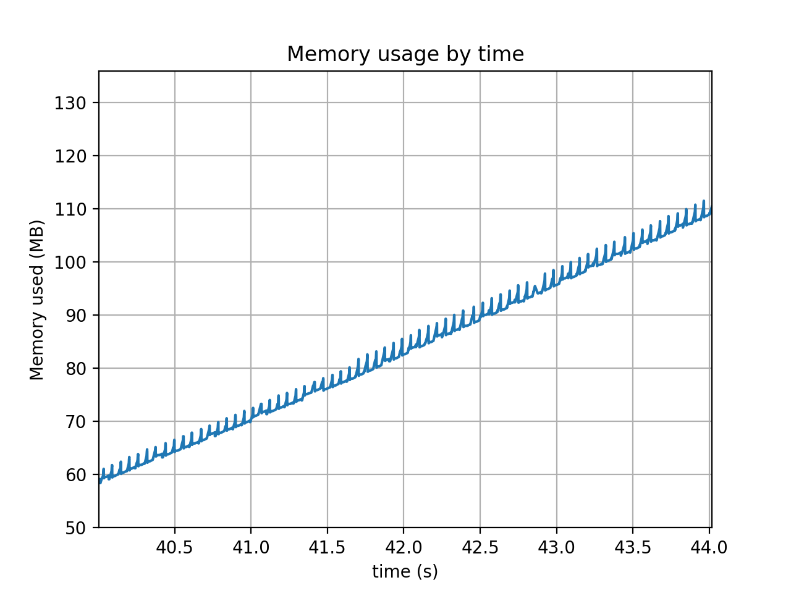

Observations on "memprof" performance
=====================================

Comparing the plotted data for the "stringio" test cases in python 2 and 3, I
noticed that the line drawn for the python3 dataset was slightly thicker than
the python2 data.  Zooming in a little in the matplotlib viewer showed this:

.. image:: Python3_stringio_1.png

Zooming even further, I got:

I saw nothing similar in the python2 data.

Conclusion
----------

There are two conclusions:

* *memprof* data capture is fine-grained enough,
* there must have been some change when the python2 *StringIO* cwcodemodule was
  moved to the python3 *io.StringIO* code.
